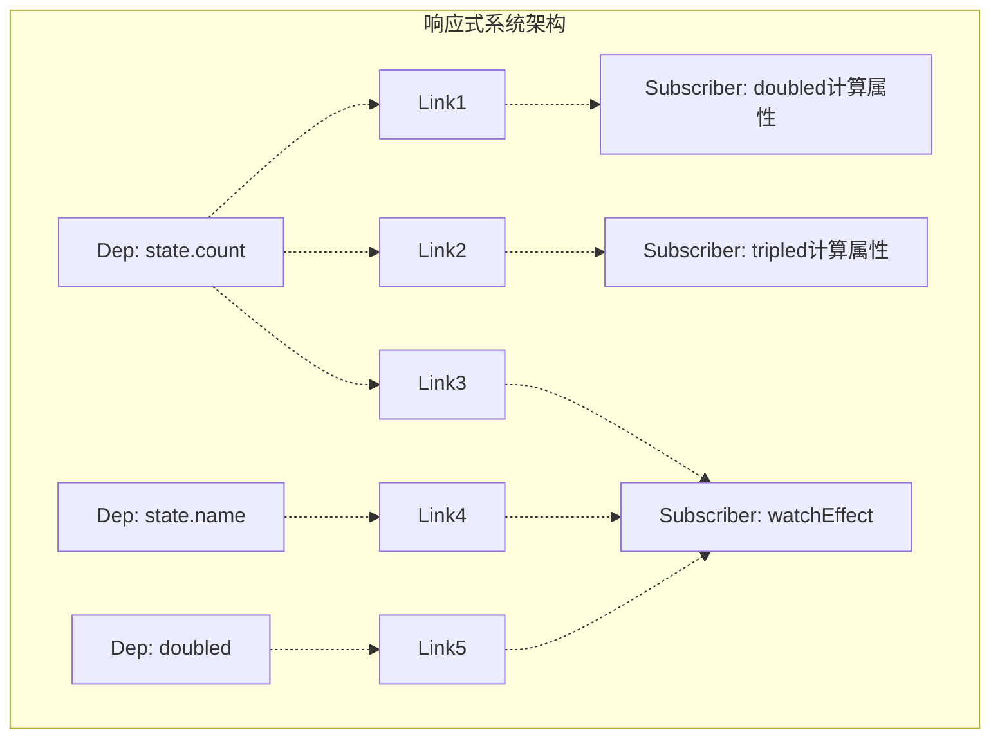

# Vue 3 响应式系统核心概念分析 - Dep、Link、Subscriber

## 概述

本文档分析Vue 3响应式系统中`dep.ts`文件第22-28行注释中的核心概念，深入理解Dep、Subscriber、Subs等组件的作用及其相互关系。

## 源码位置

- **文件**: `packages/reactivity/src/dep.ts`
- **行数**: 22-28行
- **核心注释**:

```typescript
/**
 * Represents a link between a source (Dep) and a subscriber (Effect or Computed).
 * Deps and subs have a many-to-many relationship - each link between a
 * dep and a sub is represented by a Link instance.
 *
 * A Link is also a node in two doubly-linked lists - one for the associated
 * sub to track all its deps, and one for the associated dep to track all its
 * subs.
 */
```

## 核心概念解析

### 1. Dep（依赖/源）

#### 定义

- **全称**: Dependency（依赖）
- **作用**: 代表一个响应式数据源
- **类型**: 类定义在`dep.ts`第66-213行

#### 核心功能

- **依赖收集**: 通过`track()`方法收集订阅者
- **变化通知**: 通过`trigger()`和`notify()`方法通知所有订阅者
- **版本管理**: 维护`version`字段，用于优化计算属性的重新计算
- **订阅者管理**: 通过双向链表结构管理所有订阅者

#### 关键属性

```typescript
class Dep {
  version = 0 // 版本号，用于优化
  activeLink?: Link // 当前活跃的链接
  subs?: Link // 订阅者链表（尾部）
  subsHead?: Link // 订阅者链表（头部，仅开发模式）
  sc: number = 0 // 订阅者计数器
  map?: KeyToDepMap // 用于对象属性依赖清理
  key?: unknown // 属性键
}
```

### 2. Subscriber（订阅者）

#### 定义

- **作用**: 消费响应式数据的实体
- **类型**: 主要包括Effect和Computed

#### 订阅者类型

**Effect（副作用）**

- `watchEffect`: 监听函数
- 组件渲染函数
- 用户自定义的副作用函数

**Computed（计算属性）**

- 计算属性实例
- 依赖其他响应式数据的衍生值

#### 工作机制

- **依赖收集阶段**: 订阅者执行时，访问响应式数据会建立依赖关系
- **响应阶段**: 当依赖的数据变化时，订阅者会被重新执行

### 3. Subs（订阅者集合）

#### 定义

- **全称**: Subscribers（订阅者们）
- **作用**: 表示订阅某个依赖的所有订阅者列表
- **实现**: 通过双向链表结构管理

#### 数据结构优势

- **高效插入/删除**: O(1)时间复杂度
- **内存友好**: 动态分配，按需使用
- **遍历便利**: 支持正向和反向遍历

### 4. Link（链接）

#### 定义

- **作用**: 连接Dep和Subscriber之间的多对多关系
- **特性**: 每个Dep-Subscriber的连接都由一个Link实例表示

#### 核心特性

```typescript
class Link {
  version: number        // 版本同步
  nextDep?: Link        // 下一个依赖（订阅者的依赖链表）
  prevDep?: Link        // 上一个依赖
  nextSub?: Link        // 下一个订阅者（依赖的订阅者链表）
  prevSub?: Link        // 上一个订阅者
  prevActiveLink?: Link // 上一个活跃链接

  constructor(
    public sub: Subscriber,  // 订阅者引用
    public dep: Dep,        // 依赖引用
  )
}
```

#### 双向链表结构

**1. 订阅者的依赖链表**

- 用途: 订阅者跟踪它依赖的所有响应式数据
- 结构: `prevDep ← Link → nextDep`

**2. 依赖的订阅者链表**

- 用途: 依赖跟踪所有订阅它的订阅者
- 结构: `prevSub ← Link → nextSub`

## 关系图示



## 工作流程示例

### 代码示例

```typescript
// 示例代码
const state = reactive({ count: 0, name: 'Vue' })
const doubled = computed(() => state.count * 2)
const tripled = computed(() => state.count * 3)

watchEffect(() => {
  console.log(`${state.name}: ${doubled.value}`)
})
```

### 依赖关系分析

#### Dep → Subscribers 映射

- **`state.count`的Dep**:
  - Subscribers: `doubled`、`tripled`、`watchEffect`
  - Links: 3个Link实例
- **`state.name`的Dep**:
  - Subscribers: `watchEffect`
  - Links: 1个Link实例
- **`doubled`的Dep**:
  - Subscribers: `watchEffect`
  - Links: 1个Link实例

#### Subscriber → Deps 映射

- **`doubled`计算属性**:
  - Dependencies: `state.count`
  - Links: 1个Link实例
- **`tripled`计算属性**:
  - Dependencies: `state.count`
  - Links: 1个Link实例
- **`watchEffect`**:
  - Dependencies: `state.name`、`doubled`
  - Links: 2个Link实例

## 设计优势

### 1. 精确追踪

- **优势**: 能准确知道哪些订阅者依赖哪些数据
- **实现**: 通过Link建立明确的一对一映射关系

### 2. 高效更新

- **优势**: 只通知真正受影响的订阅者
- **机制**: 避免不必要的重新计算和DOM更新

### 3. 内存管理

- **优势**: 高效管理依赖关系的建立和清理
- **实现**: 双向链表支持O(1)的插入删除操作

### 4. 版本优化

- **优势**: 计算属性可以快速跳过不必要的重新计算
- **机制**: 通过版本号比较判断是否需要更新

## 核心算法

### 依赖收集（track）

```typescript
// 简化的依赖收集流程
function track(target: object, key: unknown): void {
  if (shouldTrack && activeSub) {
    let dep = getDepFromTarget(target, key)
    if (!dep) {
      dep = createNewDep(target, key)
    }
    dep.track() // 建立Link连接
  }
}
```

### 变化通知（trigger）

```typescript
// 简化的变化通知流程
function trigger(target: object, key: unknown): void {
  const dep = getDepFromTarget(target, key)
  if (dep) {
    dep.trigger() // 通知所有订阅者
  }
}
```

## 性能考虑

### 1. 批处理优化

- **机制**: `startBatch()` 和 `endBatch()` 确保批量更新
- **优势**: 避免重复的DOM操作

### 2. 版本号优化

- **机制**: 全局版本号 `globalVersion` 和局部版本号
- **优势**: 计算属性可以快速判断是否需要重新计算

### 3. 双向链表优化

- **机制**: O(1)的插入删除操作
- **优势**: 高效的依赖关系管理

## 总结

Vue 3的响应式系统通过Dep、Subscriber、Link三者的精妙设计，实现了：

1. **高效的依赖收集**: 精确追踪数据使用关系
2. **精准的变化通知**: 只更新真正需要更新的部分
3. **优秀的内存管理**: 通过双向链表高效管理关系
4. **出色的性能优化**: 版本号机制避免不必要的计算

这种设计体现了Vue 3在性能、内存使用和开发体验之间的完美平衡，是现代前端框架响应式系统的典型实现。
