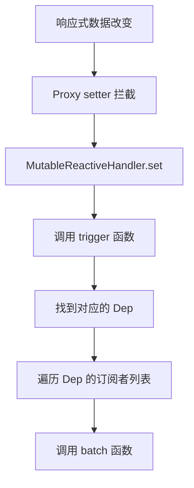
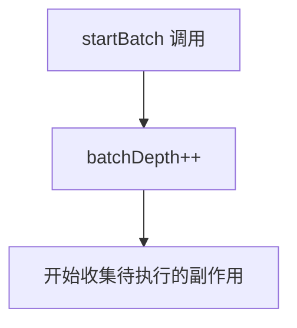
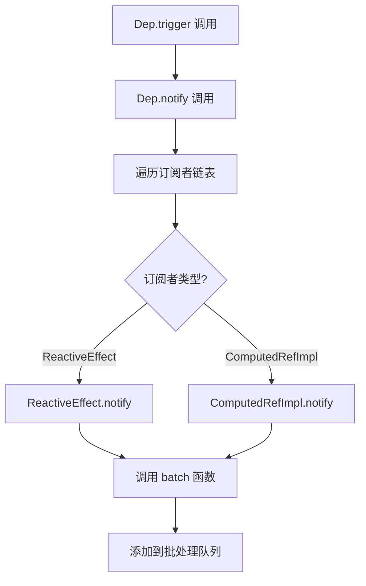
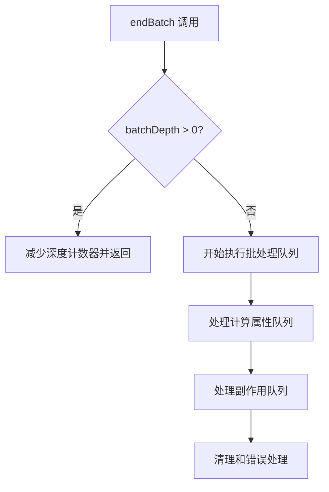
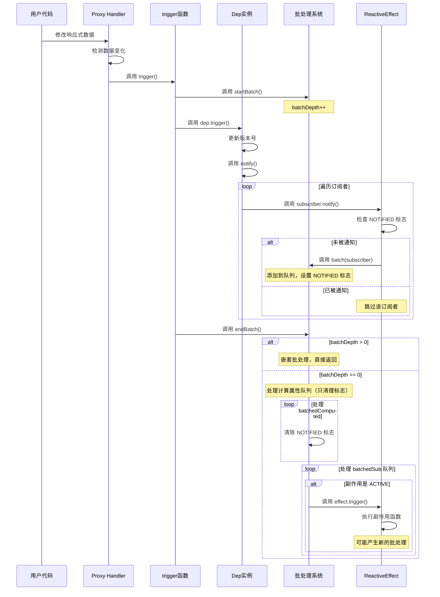

# Vue 3 响应式系统批处理执行流程详解

## 概述

Vue 3 的响应式系统采用了批处理机制来优化性能，避免在同一个同步任务中多次执行相同的副作用。本文档详细分析了从数据改变到批处理执行的完整过程。

## 核心概念

### 1. 关键全局变量

- **activeSub**: 当前活跃的订阅者（ReactiveEffect 或 ComputedRefImpl）
- **batchDepth**: 批处理嵌套深度计数器
- **batchedSub**: 待执行的副作用链表头
- **batchedComputed**: 待执行的计算属性链表头
- **shouldTrack**: 全局依赖收集开关

### 2. 核心类和接口

- **ReactiveEffect**: 副作用类，负责执行用户定义的副作用函数
- **ComputedRefImpl**: 计算属性实现，支持懒计算和缓存
- **Dep**: 依赖管理器，维护订阅者列表
- **Link**: 连接 Dep 和 Subscriber 的桥梁

### 3. 批处理机制核心原理

批处理机制的核心在于：

1. **订阅者通知阶段**: 在 Dep.notify() 中遍历订阅者，调用各自的 notify() 方法
2. **队列收集阶段**: 订阅者的 ReactiveEffect.notify() 方法调用 batch(this) 函数，将自己加入批处理队列
3. **批量执行阶段**: 在 endBatch() 中执行所有收集到的副作用

## 完整执行流程

### 第一阶段：数据改变触发响应式更新



#### 1.1 数据改变检测

```typescript
// 在 MutableReactiveHandler.set 中
const result = Reflect.set(target, key, value, receiver)
if (hadKey) {
  if (hasChanged(value, oldValue)) {
    trigger(target, TriggerOpTypes.SET, key, value, oldValue)
  }
} else {
  trigger(target, TriggerOpTypes.ADD, key, value)
}
```

#### 1.2 触发更新

```typescript
// trigger 函数的真实源码实现
export function trigger(
  target: object,
  type: TriggerOpTypes,
  key?: unknown,
  newValue?: unknown,
  oldValue?: unknown,
  oldTarget?: Map<unknown, unknown> | Set<unknown>,
): void {
  // 从全局依赖映射表中获取目标对象的依赖映射
  const depsMap = targetMap.get(target)

  // 如目标对象从未被追踪，则无需触发任何副作用
  if (!depsMap) {
    // 增加全局版本号，用于标记系统状态变化
    globalVersion++
    return
  }

  // 定义内部辅助函数，用于执行单个依赖的所有副作用
  const run = (dep: Dep | undefined) => {
    if (dep) {
      if (__DEV__) {
        // 开发模式下，传递详细的调试信息
        dep.trigger({
          target,
          type,
          key,
          newValue,
          oldValue,
          oldTarget,
        })
      } else {
        // 生产模式下，只调用简化的 trigger 方法
        dep.trigger()
      }
    }
  }

  startBatch()

  // 根据不同的操作类型执行不同的触发逻辑
  if (type === TriggerOpTypes.CLEAR) {
    // 集合被清空的情况（如 Map.clear() 或 Set.clear()）
    // 需要触发目标对象的所有副作用
    depsMap.forEach(run)
  } else {
    // 缓存目标对象的类型检查结果
    const targetIsArray = isArray(target)
    const isArrayIndex = targetIsArray && isIntegerKey(key)

    // 特殊处理数组长度变化的情况
    if (targetIsArray && key === 'length') {
      const newLength = Number(newValue)

      // 遍历所有依赖，检查哪些需要被触发
      depsMap.forEach((dep, key) => {
        if (
          key === 'length' || // length 属性本身的依赖
          key === ARRAY_ITERATE_KEY || // 数组迭代操作的依赖
          (!isSymbol(key) && key >= newLength) // 被删除的索引位置的依赖
        ) {
          run(dep)
        }
      })
    } else {
      // 处理 SET | ADD | DELETE 操作的触发逻辑

      // 触发特定属性键的依赖（如果存在）
      if (key !== void 0 || depsMap.has(void 0)) {
        run(depsMap.get(key))
      }

      // 对于数组索引的数值变化，需要触发数组迭代相关的副作用
      if (isArrayIndex) {
        run(depsMap.get(ARRAY_ITERATE_KEY))
      }

      // 根据具体的操作类型执行相应的迭代键触发逻辑
      switch (type) {
        case TriggerOpTypes.ADD:
          if (!targetIsArray) {
            // 对象添加属性：触发对象迭代相关的副作用
            run(depsMap.get(ITERATE_KEY))
            if (isMap(target)) {
              // Map 类型还需要触发键迭代相关的副作用
              run(depsMap.get(MAP_KEY_ITERATE_KEY))
            }
          } else if (isArrayIndex) {
            // 数组添加新索引 -> 引起长度变化
            run(depsMap.get('length'))
          }
          break

        case TriggerOpTypes.DELETE:
          if (!targetIsArray) {
            // 对象删除属性：触发对象迭代相关的副作用
            run(depsMap.get(ITERATE_KEY))
            if (isMap(target)) {
              // Map 类型还需要触发键迭代相关的副作用
              run(depsMap.get(MAP_KEY_ITERATE_KEY))
            }
          }
          break

        case TriggerOpTypes.SET:
          if (isMap(target)) {
            // Map 设置操作：可能会影响迭代结果
            run(depsMap.get(ITERATE_KEY))
          }
          break
      }
    }
  }

  // 结束批量更新
  endBatch()
}
```

### 第二阶段：批处理开始



#### 2.1 开始批处理

```typescript
/**
 * 开始批处理操作，递增批处理深度计数器
 * 支持嵌套的批处理操作
 */
export function startBatch(): void {
  batchDepth++
}
```

### 第三阶段：依赖触发和副作用收集



#### 3.1 Dep 触发机制

```typescript
/**
 * Dep.trigger() 方法：更新版本号并通知订阅者
 */
trigger(debugInfo?: DebuggerEventExtraInfo): void {
  // 更新本地版本
  this.version++
  // 更新全局版本
  globalVersion++
  // 通知所有订阅者
  this.notify(debugInfo)
}

/**
 * Dep.notify() 方法：实际的批处理逻辑
 * 采用链表遍历确保按原始顺序处理
 */
notify(debugInfo?: DebuggerEventExtraInfo): void {
  startBatch()
  try {
    if (__DEV__) {
      // 开发模式：按原始顺序执行调试钩子
      for (let head = this.subsHead; head; head = head.nextSub) {
        if (head.sub.onTrigger && !(head.sub.flags & EffectFlags.NOTIFIED)) {
          head.sub.onTrigger({
            effect: head.sub,
            target: this.target,
            key: this.key,
            type: this.type,
            newValue: this.newValue,
            oldValue: this.oldValue
          })
        }
      }
    }

    // 关键步骤：遍历订阅者并调用各自的 notify() 方法
    for (let link = this.subs; link; link = link.prevSub) {
      // 调用订阅者的 notify() 方法
      if (link.sub.notify()) {
        // 如果订阅者是 computed，需要继续通知其依赖项
        ;(link.sub as ComputedRefImpl).dep.notify()
      }
    }
  } finally {
    endBatch()
  }
}
```

#### 3.2 订阅者通知机制

```typescript
/**
 * ReactiveEffect.notify() 方法：将副作用加入批处理队列
 */
notify(): void {
  // 防止递归执行
  if (
    this.flags & EffectFlags.RUNNING &&
    !(this.flags & EffectFlags.ALLOW_RECURSE)
  ) {
    return
  }
  // 如果尚未被通知，则加入批处理队列
  if (!(this.flags & EffectFlags.NOTIFIED)) {
    batch(this) // 这里调用 batch 函数
  }
}

/**
 * ComputedRefImpl.notify() 方法：将计算属性加入批处理队列
 */
notify(): true | void {
  this.flags |= EffectFlags.DIRTY
  if (
    !(this.flags & EffectFlags.NOTIFIED) &&
    // 避免无限递归
    activeSub !== this
  ) {
    batch(this, true) // 计算属性的 batch 调用
    return true
  }
}

/**
 * batch 函数：将订阅者添加到批处理队列中
 */
export function batch(sub: Subscriber, isComputed = false): void {
  // 为订阅者添加 NOTIFIED 标志，表示该订阅者已被通知但尚未执行
  sub.flags |= EffectFlags.NOTIFIED

  // 如果是计算属性，添加到计算属性专用的批处理队列
  if (isComputed) {
    sub.next = batchedComputed
    batchedComputed = sub
    return
  }

  // 如果是普通副作用，添加到副作用批处理队列
  sub.next = batchedSub
  batchedSub = sub
}
```

### 第四阶段：批处理执行



#### 4.1 批处理结束和执行

```typescript
/**
 * 结束批处理操作，清理批处理队列并执行所有待处理的副作用
 * 这是响应式系统批处理机制的核心函数，确保副作用的正确执行顺序
 */
export function endBatch(): void {
  // 递减批处理深度计数器，如果还有嵌套的批处理未完成则直接返回
  if (--batchDepth > 0) {
    return
  }

  // 第一阶段：处理批处理的计算属性队列（只清理标志，不执行）
  // 计算属性采用懒计算机制，不在这里执行，而是在被访问时才重新计算
  if (batchedComputed) {
    let e: Subscriber | undefined = batchedComputed
    // 清空全局计算属性队列
    batchedComputed = undefined
    // 遍历计算属性链表，清理每个计算属性的状态
    while (e) {
      const next: Subscriber | undefined = e.next
      // 断开链表连接，防止内存泄漏
      e.next = undefined
      // 清除 NOTIFIED 标志，表示该计算属性已被处理
      e.flags &= ~EffectFlags.NOTIFIED
      e = next
    }
  }

  // 第二阶段：处理批处理的副作用队列（实际执行）
  let error: unknown
  // 处理批处理的副作用队列，可能需要多轮处理
  while (batchedSub) {
    let e: Subscriber | undefined = batchedSub
    // 清空全局副作用队列
    batchedSub = undefined
    // 遍历副作用链表
    while (e) {
      const next: Subscriber | undefined = e.next
      // 断开链表连接，防止内存泄漏
      e.next = undefined
      // 清除 NOTIFIED 标志
      e.flags &= ~EffectFlags.NOTIFIED
      // 只有当副作用处于激活状态时才执行
      if (e.flags & EffectFlags.ACTIVE) {
        try {
          // 执行 ReactiveEffect.trigger() 方法
          ;(e as ReactiveEffect).trigger()
        } catch (err) {
          // 收集第一个错误，但继续处理剩余的副作用
          if (!error) error = err
        }
      }
      e = next
    }
  }

  // 如果在执行过程中有错误发生，在所有副作用处理完成后抛出
  if (error) throw error
}
```

## 详细函数调用链路分析

### 完整调用链路图



### 关键函数详细分析

#### 1. trigger 函数

**位置**: `packages/reactivity/src/dep.ts`
**作用**: 响应式更新的入口点，负责收集依赖并触发相关依赖

```typescript
// 核心调用流程
trigger() -> 收集依赖 -> startBatch() -> dep.trigger() -> endBatch()
```

#### 2. Dep.trigger 方法

**位置**: `packages/reactivity/src/dep.ts`
**作用**: 更新版本号并调用 notify 方法

```typescript
// Dep.trigger() 只做三件事：
// 1. 更新本地版本号
// 2. 更新全局版本号
// 3. 调用 notify() 方法
```

#### 3. Dep.notify 方法

**位置**: `packages/reactivity/src/dep.ts`
**作用**: 实际的批处理逻辑，遍历订阅者并调用各自的 notify 方法

```typescript
// 调用时机：在 Dep.trigger() 中被调用
// 批处理管理：在这里调用 startBatch() 和 endBatch()
// 订阅者通知：调用每个订阅者的 notify() 方法
```

#### 4. ReactiveEffect.notify / ComputedRefImpl.notify

**位置**: `packages/reactivity/src/effect.ts` / `packages/reactivity/src/computed.ts`
**作用**: 将订阅者加入批处理队列

```typescript
// 调用时机：在 Dep.notify() 遍历订阅者时被调用
// 批处理入口：在这里调用 batch() 函数
// 状态管理：检查和设置 NOTIFIED 标志
```

#### 4. endBatch 函数

**位置**: `packages/reactivity/src/effect.ts`
**作用**: 结束批处理并执行所有收集的副作用

```typescript
// 执行顺序：
// 1. 检查嵌套深度
// 2. 处理计算属性（优先级更高）
// 3. 循环处理副作用队列（可能多轮）
// 4. 错误收集和抛出
```

## 性能优化机制

### 1. 批处理优化

- **去重机制**: 通过 `NOTIFIED` 标志避免重复执行
- **分类处理**: 计算属性和副作用分别处理，优先级明确
- **嵌套支持**: 支持嵌套的批处理操作

### 2. 执行顺序优化

- **计算属性优先**: 确保依赖数据的正确性
- **链表遍历**: 按原始添加顺序执行，保证可预测性
- **多轮处理**: 处理副作用执行过程中产生的新副作用

### 3. 内存管理

- **链表断开**: 及时断开 `next` 引用防止内存泄漏
- **标志清理**: 清除 `NOTIFIED` 标志重置状态
- **错误隔离**: 错误不影响其他副作用的执行

## 实际应用场景

### 场景1：组件更新

```typescript
// 用户代码
const state = reactive({ count: 0 })

// 组件副作用
const effect = new ReactiveEffect(() => {
  console.log('组件更新:', state.count)
})

// 数据改变
state.count++ // 触发批处理机制
```

### 场景2：计算属性依赖

```typescript
const state = reactive({ a: 1, b: 2 })
const sum = computed(() => state.a + state.b)

// 同时修改多个依赖
state.a = 10
state.b = 20
// 批处理确保 sum 只重新计算一次
```

## 总结

Vue 3 的批处理机制通过以下关键设计实现了高性能的响应式更新：

1. **分层设计**:

   - `trigger()` 函数负责收集依赖并开始批处理
   - `Dep.trigger()` 和 `Dep.notify()` 负责版本管理和订阅者通知
   - `ReactiveEffect.notify()` / `ComputedRefImpl.notify()` 负责将订阅者加入批处理队列
   - `endBatch()` 负责执行所有收集到的副作用

2. **队列管理**:

   - `batch()` 函数将订阅者分类收集到不同的队列中
   - 计算属性和副作用分别处理，优先级明确

3. **防重复机制**:

   - `NOTIFIED` 标志避免重复执行
   - 状态管理确保一致性

4. **错误处理**:

   - 收集错误但不中断批处理流程
   - 统一错误处理机制

5. **内存管理**:
   - 及时断开链表引用防止内存泄漏
   - 清除标志重置状态

这种设计确保了在复杂的响应式场景下，Vue 3 能够高效、有序地处理数据变化，为用户提供流畅的使用体验。

## 关键调用链路总结

正确的调用链路应该是：

```
响应式数据修改
→ Proxy 拦截
→ trigger() 函数
→ startBatch()
→ Dep.trigger()
→ Dep.notify()
→ 遍历订阅者
→ 订阅者.notify()
→ batch() 函数
→ endBatch()
→ 执行副作用
```

这个流程中，每个环节都有其特定的职责，共同实现了高效的批处理机制。
