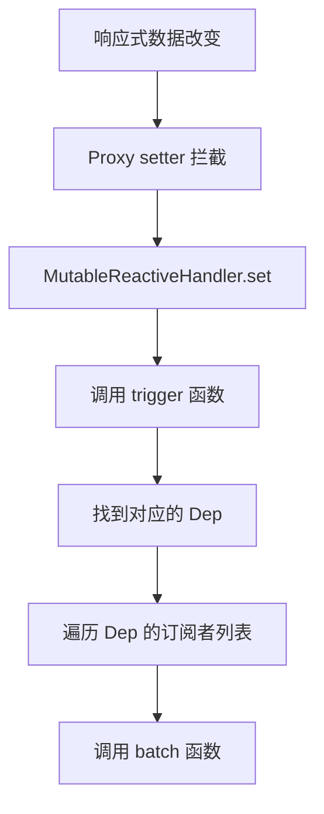
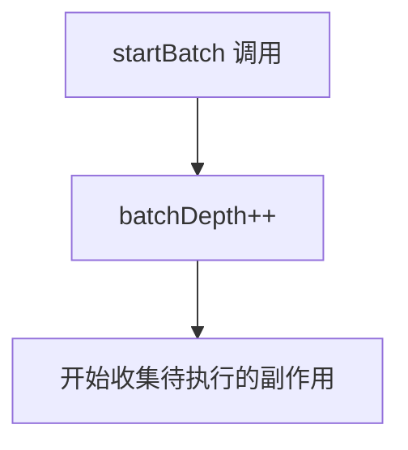
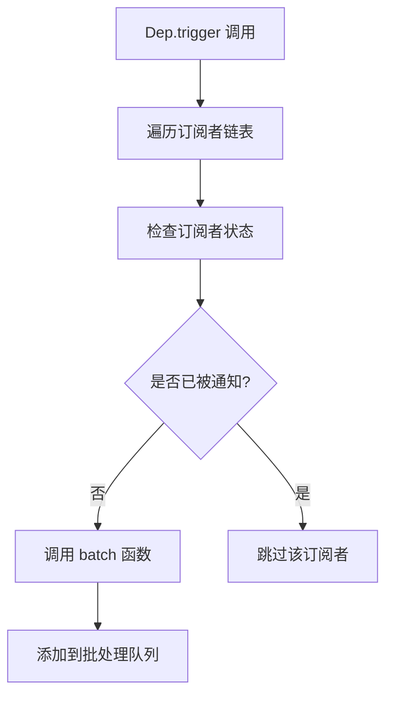
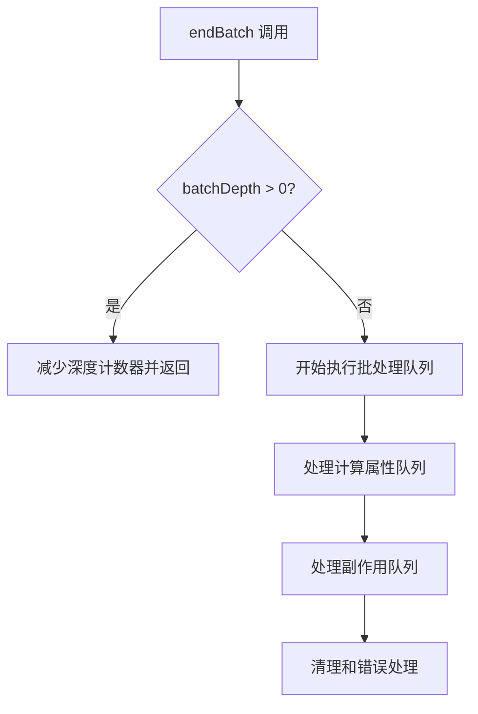
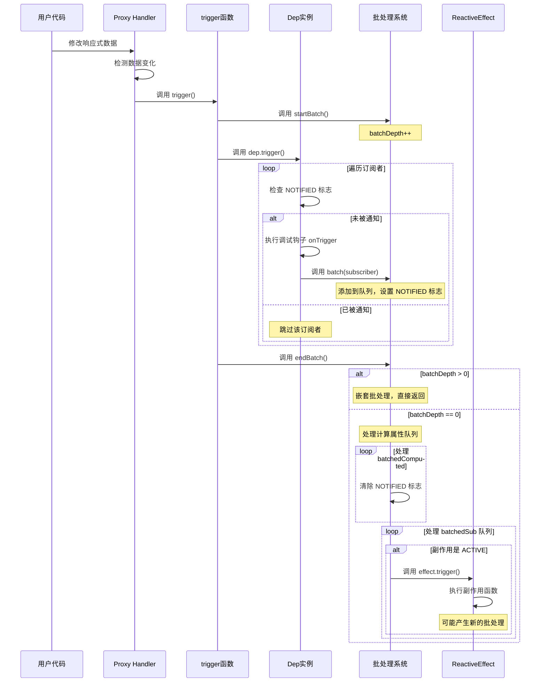

# Vue 3 响应式系统批处理执行流程详解

## 概述

Vue 3 的响应式系统采用了批处理机制来优化性能，避免在同一个同步任务中多次执行相同的副作用。本文档详细分析了从数据改变到批处理执行的完整过程。

## 核心概念

### 1. 关键全局变量

- **activeSub**: 当前活跃的订阅者（ReactiveEffect 或 ComputedRefImpl）
- **batchDepth**: 批处理嵌套深度计数器
- **batchedSub**: 待执行的副作用链表头
- **batchedComputed**: 待执行的计算属性链表头
- **shouldTrack**: 全局依赖收集开关

### 2. 核心类和接口

- **ReactiveEffect**: 副作用类，负责执行用户定义的副作用函数
- **ComputedRefImpl**: 计算属性实现，支持懒计算和缓存
- **Dep**: 依赖管理器，维护订阅者列表
- **Link**: 连接 Dep 和 Subscriber 的桥梁

## 完整执行流程

### 第一阶段：数据改变触发响应式更新



#### 1.1 数据改变检测

```typescript
// 在 MutableReactiveHandler.set 中
const result = Reflect.set(target, key, value, receiver)
if (hadKey) {
  if (hasChanged(value, oldValue)) {
    trigger(target, TriggerOpTypes.SET, key, value, oldValue)
  }
} else {
  trigger(target, TriggerOpTypes.ADD, key, value)
}
```

#### 1.2 触发更新

```typescript
// trigger 函数的核心逻辑
export function trigger(
  target: object,
  type: TriggerOpTypes,
  key?: unknown,
  newValue?: unknown,
  oldValue?: unknown,
  oldTarget?: Map<unknown, unknown> | Set<unknown>,
): void {
  const depsMap = targetMap.get(target)
  if (!depsMap) {
    return
  }

  const deps: Dep[] = []

  // 收集需要触发的依赖
  if (key !== void 0) {
    const dep = depsMap.get(key)
    if (dep) {
      deps.push(dep)
    }
  }

  // 批量触发依赖
  startBatch()
  for (const dep of deps) {
    if (dep) {
      dep.trigger()
    }
  }
  endBatch()
}
```

### 第二阶段：批处理开始



#### 2.1 开始批处理

```typescript
/**
 * 开始批处理操作，递增批处理深度计数器
 * 支持嵌套的批处理操作
 */
export function startBatch(): void {
  batchDepth++
}
```

### 第三阶段：依赖触发和副作用收集



#### 3.1 Dep 触发机制

```typescript
/**
 * 触发依赖的所有订阅者
 * 采用链表遍历确保按原始顺序处理
 */
trigger(): void {
  startBatch()
  try {
    // 遍历订阅者链表，按原始顺序处理
    for (let head = this.subsHead; head; head = head.nextSub) {
      // 检查订阅者是否需要通知
      if (head.flags & SubscriberFlags.NOTIFIED) {
        continue // 已被通知，跳过
      }

      // 执行调试钩子（如果存在）
      if (head.onTrigger && !(head.flags & SubscriberFlags.NOTIFIED)) {
        head.onTrigger({
          effect: head,
          target: this.target,
          key: this.key,
          type: this.type,
          newValue: this.newValue,
          oldValue: this.oldValue
        })
      }

      // 添加到批处理队列
      batch(head, head.flags & SubscriberFlags.COMPUTED)
    }
  } finally {
    endBatch()
  }
}
```

#### 3.2 批处理队列管理

```typescript
/**
 * 将订阅者添加到批处理队列中
 * 这是响应式系统批处理机制的入口函数，用于收集需要延迟执行的副作用和计算属性
 */
export function batch(sub: Subscriber, isComputed = false): void {
  // 为订阅者添加 NOTIFIED 标志，表示该订阅者已被通知但尚未执行
  // 这个标志用于防止同一个订阅者在同一批次中被重复添加
  sub.flags |= EffectFlags.NOTIFIED

  // 如果是计算属性，添加到计算属性专用的批处理队列
  if (isComputed) {
    // 使用链表结构存储，新的计算属性插入到队列头部
    sub.next = batchedComputed
    batchedComputed = sub
    return
  }

  // 如果是普通副作用，添加到副作用批处理队列
  // 同样使用链表结构，新的副作用插入到队列头部
  sub.next = batchedSub
  batchedSub = sub
}
```

### 第四阶段：批处理执行



#### 4.1 批处理结束和执行

```typescript
/**
 * 结束批处理操作，清理批处理队列并执行所有待处理的副作用
 * 这是响应式系统批处理机制的核心函数，确保副作用的正确执行顺序
 */
export function endBatch(): void {
  // 递减批处理深度计数器，如果还有嵌套的批处理未完成则直接返回
  if (--batchDepth > 0) {
    return
  }

  // 首先处理批处理的计算属性队列
  if (batchedComputed) {
    let e: Subscriber | undefined = batchedComputed
    // 清空全局计算属性队列，防止在处理过程中新的计算属性被添加到当前批次
    batchedComputed = undefined
    // 遍历计算属性链表，清理每个计算属性的状态
    while (e) {
      const next: Subscriber | undefined = e.next
      // 断开链表连接，防止内存泄漏
      e.next = undefined
      // 清除 NOTIFIED 标志，表示该计算属性已被处理
      e.flags &= ~EffectFlags.NOTIFIED
      e = next
    }
  }

  // 用于收集执行过程中的错误
  let error: unknown
  // 处理批处理的副作用队列，可能需要多轮处理（因为副作用执行可能产生新的副作用）
  while (batchedSub) {
    let e: Subscriber | undefined = batchedSub
    // 清空全局副作用队列，为当前轮次的处理做准备
    batchedSub = undefined
    // 遍历副作用链表
    while (e) {
      const next: Subscriber | undefined = e.next
      // 断开链表连接，防止内存泄漏
      e.next = undefined
      // 清除 NOTIFIED 标志，表示该副作用已被处理
      e.flags &= ~EffectFlags.NOTIFIED
      // 只有当副作用处于激活状态时才执行
      if (e.flags & EffectFlags.ACTIVE) {
        try {
          // ACTIVE 标志仅用于副作用（ReactiveEffect），计算属性不会有此标志
          // 执行副作用的触发器，这可能会导致新的依赖收集和触发
          ;(e as ReactiveEffect).trigger()
        } catch (err) {
          // 收集第一个错误，但继续处理剩余的副作用
          if (!error) error = err
        }
      }
      e = next
    }
  }

  // 如果在执行过程中有错误发生，在所有副作用处理完成后抛出
  if (error) throw error
}
```

## 详细函数调用链路分析

### 完整调用链路图



### 关键函数详细分析

#### 1. trigger 函数

**位置**: `packages/reactivity/src/effect.ts`
**作用**: 响应式更新的入口点，负责启动批处理并触发相关依赖

```typescript
// 核心调用流程
trigger() -> startBatch() -> dep.trigger() -> endBatch()
```

#### 2. startBatch 函数

**位置**: `packages/reactivity/src/effect.ts`
**作用**: 开始批处理，支持嵌套

```typescript
export function startBatch(): void {
  batchDepth++
}
```

#### 3. batch 函数

**位置**: `packages/reactivity/src/effect.ts`
**作用**: 将订阅者添加到相应的批处理队列

```typescript
// 调用时机：在 Dep.trigger() 遍历订阅者时被调用
// 队列分类：计算属性队列 vs 副作用队列
// 防重复：通过 NOTIFIED 标志避免重复添加
```

#### 4. endBatch 函数

**位置**: `packages/reactivity/src/effect.ts`
**作用**: 结束批处理并执行所有收集的副作用

```typescript
// 执行顺序：
// 1. 检查嵌套深度
// 2. 处理计算属性（优先级更高）
// 3. 循环处理副作用队列（可能多轮）
// 4. 错误收集和抛出
```

## 性能优化机制

### 1. 批处理优化

- **去重机制**: 通过 `NOTIFIED` 标志避免重复执行
- **分类处理**: 计算属性和副作用分别处理，优先级明确
- **嵌套支持**: 支持嵌套的批处理操作

### 2. 执行顺序优化

- **计算属性优先**: 确保依赖数据的正确性
- **链表遍历**: 按原始添加顺序执行，保证可预测性
- **多轮处理**: 处理副作用执行过程中产生的新副作用

### 3. 内存管理

- **链表断开**: 及时断开 `next` 引用防止内存泄漏
- **标志清理**: 清除 `NOTIFIED` 标志重置状态
- **错误隔离**: 错误不影响其他副作用的执行

## 实际应用场景

### 场景1：组件更新

```typescript
// 用户代码
const state = reactive({ count: 0 })

// 组件副作用
const effect = new ReactiveEffect(() => {
  console.log('组件更新:', state.count)
})

// 数据改变
state.count++ // 触发批处理机制
```

### 场景2：计算属性依赖

```typescript
const state = reactive({ a: 1, b: 2 })
const sum = computed(() => state.a + state.b)

// 同时修改多个依赖
state.a = 10
state.b = 20
// 批处理确保 sum 只重新计算一次
```

## 总结

Vue 3 的批处理机制通过以下关键设计实现了高性能的响应式更新：

1. **分层设计**: startBatch/endBatch 控制批处理生命周期
2. **队列管理**: batch 函数负责收集待执行的副作用
3. **优先级处理**: 计算属性优先于普通副作用执行
4. **防重复机制**: NOTIFIED 标志避免重复执行
5. **错误处理**: 收集错误但不中断批处理流程

这种设计确保了在复杂的响应式场景下，Vue 3 能够高效、有序地处理数据变化，为用户提供流畅的使用体验。
