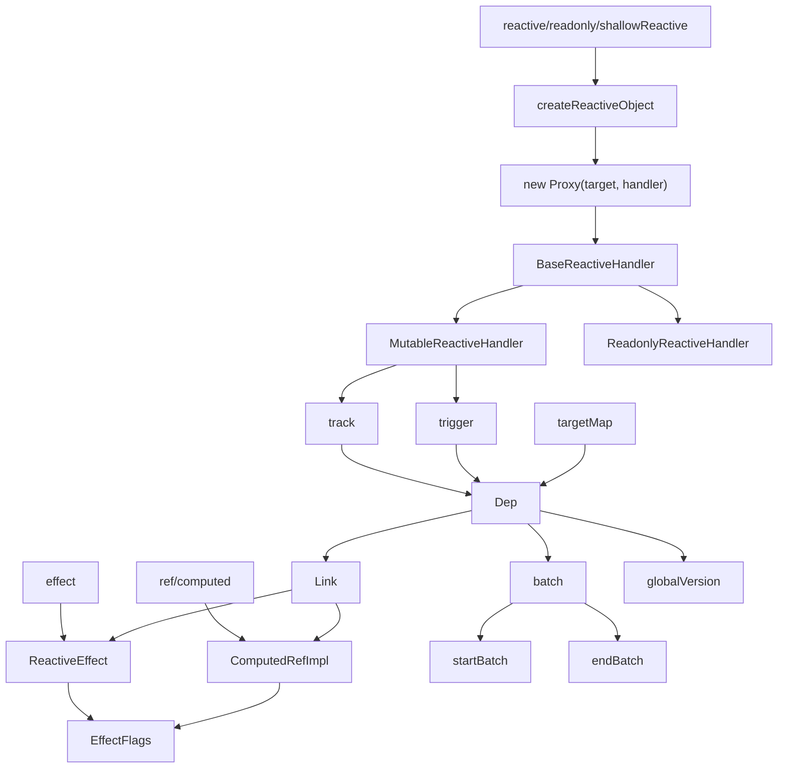
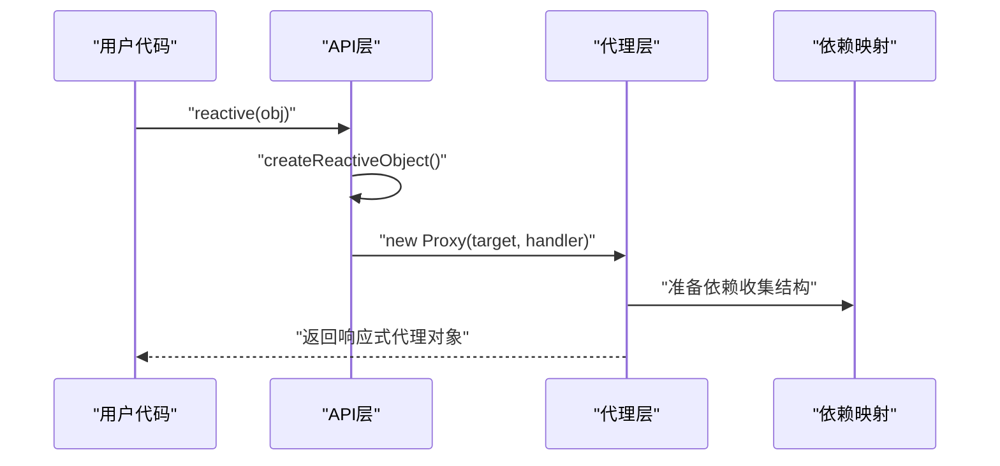
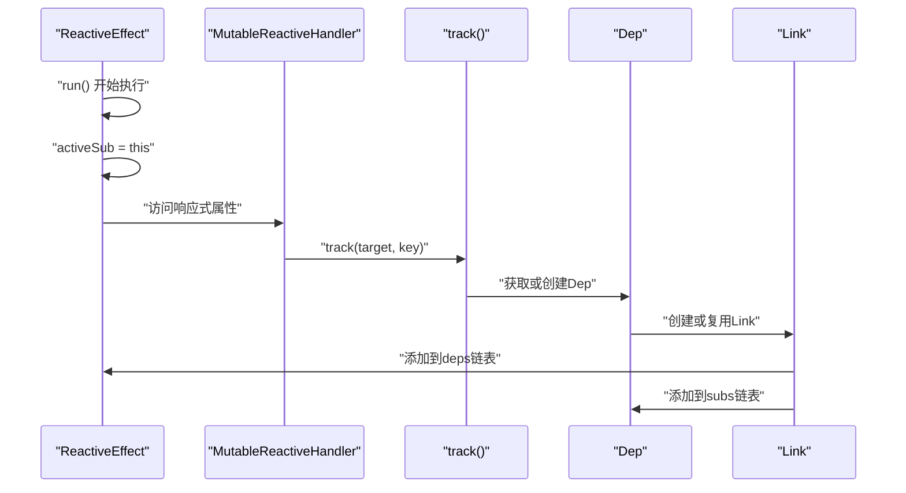
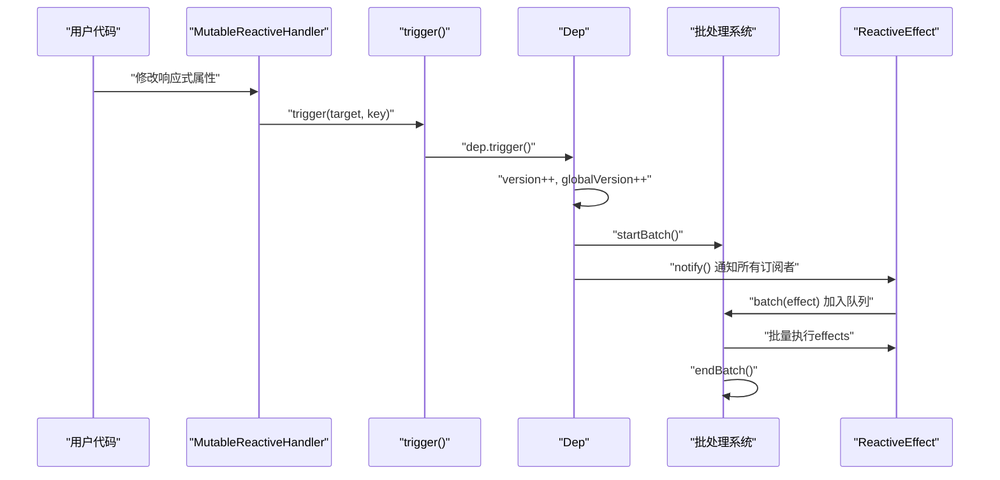

# Vue 3 响应式系统架构分析与流程图

## 1. 核心类关系图



## 2. 核心类职责说明

### 2.1 用户API层

| 类/函数      | 职责               | 核心功能               |
| ------------ | ------------------ | ---------------------- |
| `reactive()` | 创建深度响应式对象 | 递归代理所有嵌套属性   |
| `ref()`      | 创建响应式引用     | 包装基本类型和对象     |
| `computed()` | 创建计算属性       | 懒计算、缓存、依赖跟踪 |
| `effect()`   | 创建副作用         | 自动执行、依赖收集     |

### 2.2 代理处理层

| 类                        | 职责           | 核心功能                     |
| ------------------------- | -------------- | ---------------------------- |
| `BaseReactiveHandler`     | 基础代理处理器 | 提供通用的get操作逻辑        |
| `MutableReactiveHandler`  | 可变代理处理器 | 处理set/delete操作，触发更新 |
| `ReadonlyReactiveHandler` | 只读代理处理器 | 阻止修改操作，发出警告       |

### 2.3 依赖管理层

| 类          | 职责         | 核心功能                         |
| ----------- | ------------ | -------------------------------- |
| `Dep`       | 依赖对象     | 管理订阅者列表、版本控制         |
| `Link`      | 依赖链接     | 连接Dep和Subscriber的桥梁        |
| `targetMap` | 全局依赖映射 | `WeakMap<object, Map<key, Dep>>` |

### 2.4 订阅者层

| 类                | 职责         | 核心功能                     |
| ----------------- | ------------ | ---------------------------- |
| `ReactiveEffect`  | 响应式副作用 | 执行函数、收集依赖、响应变化 |
| `ComputedRefImpl` | 计算属性实现 | 懒计算、缓存、作为依赖源     |

## 3. 响应式系统工作流程

### 3.1 初始化阶段



### 3.2 依赖收集阶段



### 3.3 响应式更新阶段



## 4. 关键设计模式分析

### 4.1 观察者模式 (Observer Pattern)

**实现**: `Dep` → `Subscriber` 关系

- **Subject**: `Dep` 类管理订阅者列表
- **Observer**: `ReactiveEffect`、`ComputedRefImpl` 实现 `Subscriber` 接口
- **优势**: 松耦合、可扩展、支持一对多关系

### 4.2 代理模式 (Proxy Pattern)

**实现**: ES6 Proxy + Handler

- **代理对象**: Proxy 实例
- **真实对象**: 原始 JavaScript 对象
- **代理处理器**: `MutableReactiveHandler`、`ReadonlyReactiveHandler`
- **优势**: 透明访问、拦截所有操作、性能优化

### 4.3 桥接模式 (Bridge Pattern)

**实现**: `Link` 类连接 `Dep` 和 `Subscriber`

- **抽象**: 依赖关系的概念
- **实现**: `Link` 的具体实现
- **优势**: 解耦依赖和订阅者、支持双向链表、便于管理

### 4.4 策略模式 (Strategy Pattern)

**实现**: 不同的 Handler 策略

- **Context**: `createReactiveObject` 函数
- **Strategy**: `mutableHandlers`、`readonlyHandlers`、`shallowHandlers`
- **优势**: 可配置行为、易于扩展、代码复用

## 5. 性能优化机制

### 5.1 版本控制系统

```typescript
// 双重版本控制
class Dep {
  version = 0 // 局部版本
}
let globalVersion = 0 // 全局版本

// 优化computed缓存
class ComputedRefImpl {
  globalVersion = globalVersion - 1

  get value() {
    if (this.globalVersion === globalVersion) {
      return this._value // 缓存命中，直接返回
    }
    // 重新计算...
  }
}
```

### 5.2 批处理机制

```typescript
// 避免同步多次更新
function batch(sub: Subscriber) {
  sub.flags |= EffectFlags.NOTIFIED
  sub.next = batchedSub
  batchedSub = sub
}

function endBatch() {
  while (batchedSub) {
    // 批量执行所有effects
  }
}
```

### 5.3 懒加载机制

```typescript
// computed的懒加载
function addSub(link: Link) {
  const computed = link.dep.computed
  if (computed && !link.dep.subs) {
    // 只有当computed获得第一个订阅者时才激活
    computed.flags |= EffectFlags.TRACKING | EffectFlags.DIRTY
    // 递归订阅computed的依赖
    for (let l = computed.deps; l; l = l.nextDep) {
      addSub(l)
    }
  }
}
```

### 5.4 链表优化

```typescript
// 双向链表 + LRU策略
class Link {
  nextDep?: Link // 订阅者的依赖链表
  prevDep?: Link
  nextSub?: Link // 依赖的订阅者链表
  prevSub?: Link
}

// LRU移到链表尾部
if (link.nextDep) {
  // 移除当前位置
  const next = link.nextDep
  next.prevDep = link.prevDep
  if (link.prevDep) {
    link.prevDep.nextDep = next
  }
  // 插入到尾部
  link.prevDep = activeSub.depsTail
  link.nextDep = undefined
  activeSub.depsTail!.nextDep = link
  activeSub.depsTail = link
}
```

## 6. 核心算法流程

### 6.1 依赖收集算法

```typescript
function track(target: object, key: unknown) {
  // 三重安全检查
  if (!activeSub || !shouldTrack || activeSub === computed) {
    return
  }

  // 获取或创建依赖结构
  let depsMap = targetMap.get(target)
  if (!depsMap) {
    targetMap.set(target, (depsMap = new Map()))
  }

  let dep = depsMap.get(key)
  if (!dep) {
    depsMap.set(key, (dep = new Dep()))
  }

  // 建立依赖关系
  dep.track()
}
```

### 6.2 响应式更新算法

```typescript
function trigger(target: object, key: unknown) {
  const depsMap = targetMap.get(target)
  if (!depsMap) return

  const dep = depsMap.get(key)
  if (!dep) return

  // 批量处理更新
  startBatch()
  dep.trigger()
  endBatch()
}
```

### 6.3 计算属性缓存算法

```typescript
function refreshComputed(computed: ComputedRefImpl) {
  // 全局版本快速路径
  if (computed.globalVersion === globalVersion) {
    return // 缓存命中
  }

  // 检查依赖是否脏
  if (!isDirty(computed)) {
    return // 依赖未变化
  }

  // 重新计算
  const value = computed.fn(computed._value)
  if (hasChanged(value, computed._value)) {
    computed._value = value
    computed.dep.version++
  }
}
```

## 7. 内存管理策略

### 7.1 WeakMap 的使用

```typescript
// 自动垃圾回收
export const targetMap: WeakMap<object, KeyToDepMap> = new WeakMap()
export const reactiveMap: WeakMap<Target, any> = new WeakMap()

// 当原始对象被垃圾回收时，相关的响应式数据自动清理
```

### 7.2 引用计数机制

```typescript
class Dep {
  sc: number = 0  // subscriber counter

  // 当计数为0时清理依赖
  if (!--dep.sc && dep.map) {
    dep.map.delete(dep.key)
  }
}
```

### 7.3 循环引用处理

```typescript
// 防止computed自引用
if (activeSub === this.computed) {
  return // 避免循环依赖
}

// 清理无用链接
function cleanupDeps(sub: Subscriber) {
  // 移除版本为-1的无用依赖
  if (link.version === -1) {
    removeSub(link)
    removeDep(link)
  }
}
```

## 8. 调试支持

### 8.1 开发模式特性

```typescript
if (__DEV__) {
  // 调试钩子
  if (activeSub.onTrack) {
    activeSub.onTrack({
      effect: activeSub,
      target,
      type,
      key,
    })
  }

  // 状态验证
  if (activeSub !== this) {
    warn('Active effect was not restored correctly')
  }
}
```

### 8.2 错误处理

```typescript
// 批处理错误聚合
let error: unknown
while (batchedSub) {
  try {
    effect.trigger()
  } catch (err) {
    if (!error) error = err
  }
}
if (error) throw error
```

## 9. 总结

Vue 3 响应式系统是一个精心设计的架构，它通过以下核心特性实现了高性能的响应式编程：

1. **分层架构**: API层、代理层、依赖管理层、订阅者层清晰分离
2. **设计模式**: 观察者、代理、桥接、策略模式的综合运用
3. **性能优化**: 版本控制、批处理、懒加载、链表优化等机制
4. **内存管理**: WeakMap、引用计数、循环引用处理
5. **开发体验**: 完善的调试支持和错误处理

这种设计不仅保证了响应式系统的高性能，还提供了良好的可维护性和扩展性，是现代前端框架架构设计的典型范例。
