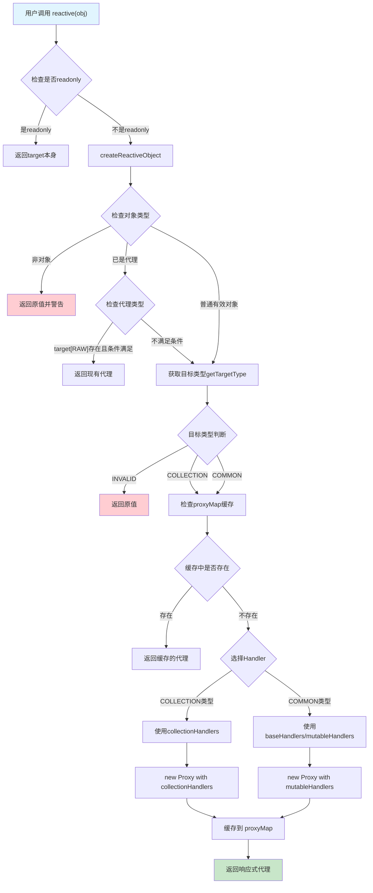
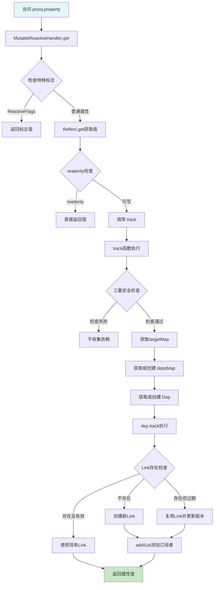
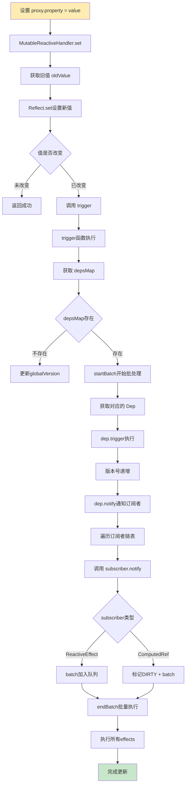
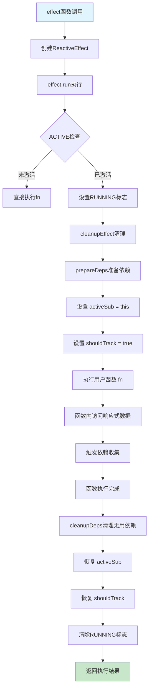
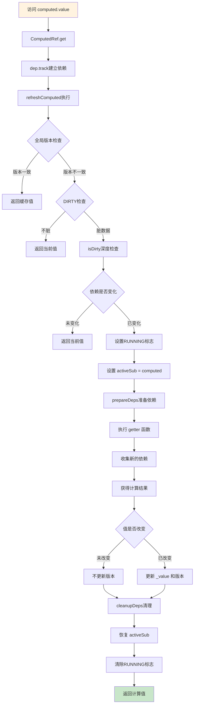
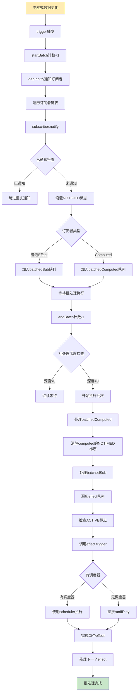
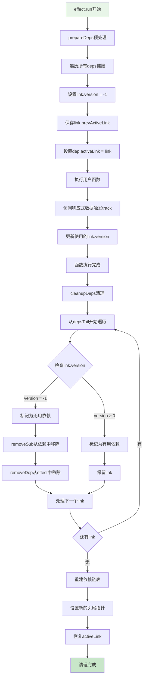
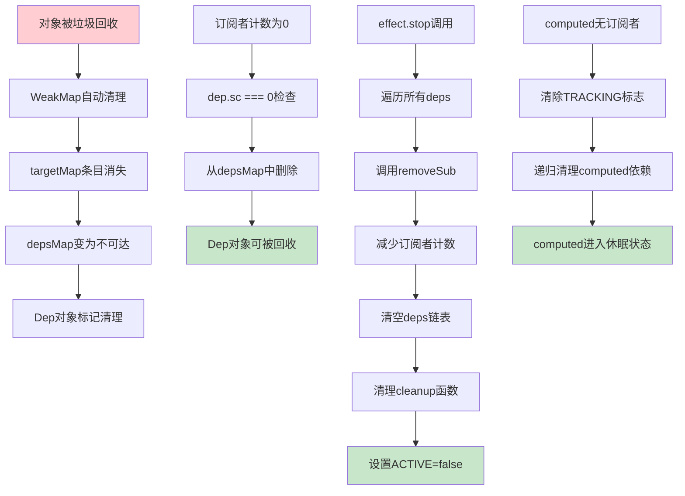
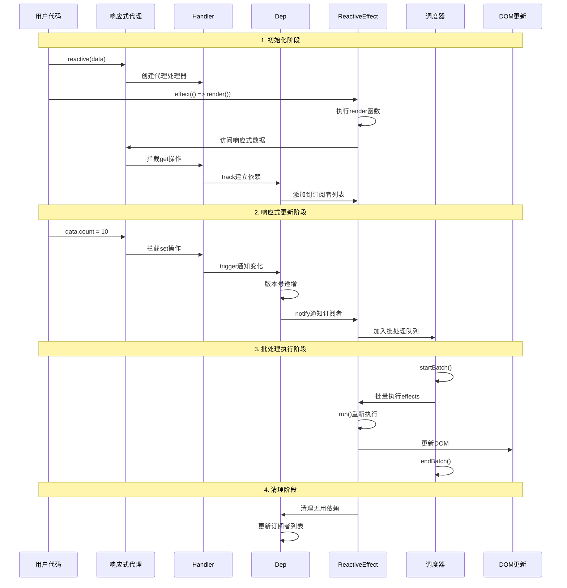

# Vue 3 响应式系统详细调用流程图

## 1. 响应式对象创建流程



## 2. 属性访问与依赖收集流程



## 3. 属性修改与响应式更新流程



## 4. Effect 执行流程



## 5. Computed 计算流程



## 6. 批处理机制详细流程



## 7. 依赖清理机制流程



## 8. 内存管理流程



## 9. 完整的响应式更新生命周期



## 10. 性能优化检查点

### 10.1 依赖收集优化检查点

```typescript
// 检查点1: 三重安全检查
if (!activeSub || !shouldTrack || activeSub === this.computed) {
  return // 避免无效的依赖收集
}

// 检查点2: Link复用
if (link === undefined || link.sub !== activeSub) {
  // 创建新Link的代价相对较高
  link = this.activeLink = new Link(activeSub, this)
} else if (link.version === -1) {
  // 复用现有Link，性能最优
  link.version = this.version
}

// 检查点3: LRU优化
if (link.nextDep) {
  // 将最近使用的依赖移到链表尾部
  // 提高后续访问的缓存命中率
}
```

### 10.2 批处理优化检查点

```typescript
// 检查点1: 防止重复通知
if (!(this.flags & EffectFlags.NOTIFIED)) {
  batch(this) // 只有未通知的effect才加入队列
}

// 检查点2: 分类批处理
if (isComputed) {
  sub.next = batchedComputed // computed优先处理
} else {
  sub.next = batchedSub // 普通effect后处理
}

// 检查点3: 错误隔离
try {
  effect.trigger()
} catch (err) {
  if (!error) error = err // 收集第一个错误
}
```

### 10.3 内存优化检查点

```typescript
// 检查点1: 自动清理
if (!--dep.sc && dep.map) {
  dep.map.delete(dep.key) // 订阅者为0时清理
}

// 检查点2: WeakMap使用
const targetMap: WeakMap<object, KeyToDepMap> = new WeakMap()
// 原始对象回收时自动清理相关依赖

// 检查点3: 循环引用避免
if (activeSub === this.computed) {
  return // 防止computed自引用
}
```

这些流程图和检查点展示了 Vue 3 响应式系统是如何通过精心设计的算法和优化策略，在保证功能完整性的同时实现高性能的响应式编程的。
