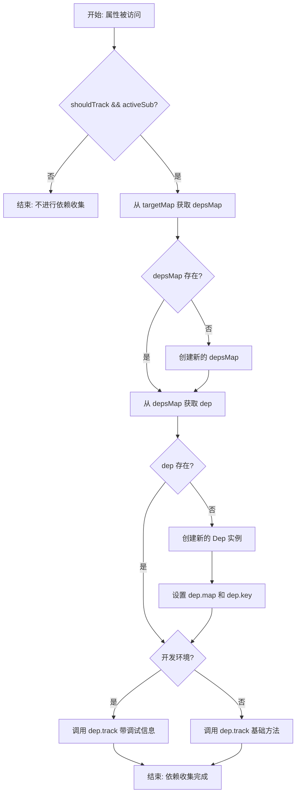

# Vue 3 track 函数依赖收集机制详细分析

## 概述

`track` 函数是 Vue 3 响应式系统的核心函数之一，负责在属性读取时收集依赖。它建立了响应式属性与副作用（effect）之间的依赖关系，是整个响应式更新机制的基础。

## 函数签名

```typescript
export function track(target: object, type: TrackOpTypes, key: unknown): void
```

### 参数说明

- **target**: 持有响应式属性的目标对象
- **type**: 定义对响应式属性的访问类型（GET、ITERATE 等）
- **key**: 要追踪的响应式属性的标识符

## 核心实现逻辑

### 1. 前置条件检查

```typescript
if (shouldTrack && activeSub) {
  // 执行依赖收集逻辑
}
```

**关键条件：**

- `shouldTrack`: 全局标志，控制是否允许进行依赖追踪
- `activeSub`: 当前活跃的订阅者（副作用），只有在副作用执行时才会有值

### 2. 三层映射结构

Vue 3 使用三层嵌套的 Map 结构来管理依赖关系：

```
targetMap (WeakMap)
├── target1 (Object) → depsMap (Map)
│   ├── key1 → Dep 实例
│   ├── key2 → Dep 实例
│   └── ...
├── target2 (Object) → depsMap (Map)
│   └── ...
```

#### 第一层：targetMap

```typescript
let depsMap = targetMap.get(target)
if (!depsMap) {
  targetMap.set(target, (depsMap = new Map()))
}
```

- 存储对象到依赖映射表的关系
- 使用 WeakMap 避免内存泄漏

#### 第二层：depsMap

```typescript
let dep = depsMap.get(key)
if (!dep) {
  depsMap.set(key, (dep = new Dep()))
  dep.map = depsMap
  dep.key = key
}
```

- 存储属性 key 到 Dep 实例的关系
- 建立反向引用（dep.map 和 dep.key）

#### 第三层：Dep 实例

- 管理具体的依赖关系
- 连接响应式属性与订阅的副作用

### 3. 依赖关系建立

```typescript
if (__DEV__) {
  dep.track({
    target,
    type,
    key,
  })
} else {
  dep.track()
}
```

**环境优化：**

- **开发环境**: 传递详细的调试信息，便于开发时调试
- **生产环境**: 只调用基础方法，优化性能

## 工作流程图



## 设计特性

### 1. 延迟初始化

- 只有在实际访问时才创建依赖映射结构
- 避免不必要的内存开销

### 2. 反向引用

```typescript
dep.map = depsMap
dep.key = key
```

- 便于从 Dep 实例反向查找其所属的映射表和键
- 支持依赖清理和调试功能

### 3. 环境差异化

- 开发环境提供丰富的调试信息
- 生产环境优化性能，减少不必要的参数传递

## 应用场景

### 1. 响应式对象属性访问

```javascript
const obj = reactive({ count: 0 })
obj.count // 触发 track(obj, 'get', 'count')
```

### 2. 响应式数组操作

```javascript
const arr = reactive([1, 2, 3])
arr.length // 触发 track(arr, 'get', 'length')
arr[0] // 触发 track(arr, 'get', '0')
```

### 3. 计算属性依赖收集

```javascript
const count = ref(0)
const doubled = computed(() => count.value * 2) // 访问 count.value 时触发 track
```

## 性能优化机制

### 1. 条件检查优先

- 在函数开始就检查 `shouldTrack && activeSub`
- 避免在不需要时执行后续逻辑

### 2. 惰性创建

- 映射结构按需创建，不预先分配
- 减少内存占用

### 3. 环境分离

- 生产环境去除调试信息，提升执行效率
- 开发环境保留完整调试能力

## 与其他组件的关系

### 1. 与 Dep 类的协作

- `track` 负责创建和查找 Dep 实例
- `Dep.track()` 负责具体的依赖关系建立

### 2. 与 trigger 函数的配合

- `track` 建立依赖关系
- `trigger` 在属性变更时触发相关副作用

### 3. 与 ReactiveEffect 的联动

- `activeSub` 通常是 ReactiveEffect 实例
- 形成完整的响应式更新循环

## 总结

`track` 函数是 Vue 3 响应式系统依赖收集的核心实现，通过巧妙的三层映射结构和条件检查，实现了高效的依赖关系管理。它与 Dep 类、trigger 函数、ReactiveEffect 等组件协同工作，构成了 Vue 3 强大的响应式系统基础。

其设计充分考虑了性能优化、内存管理和开发体验，是现代前端框架中响应式系统设计的典型范例。
